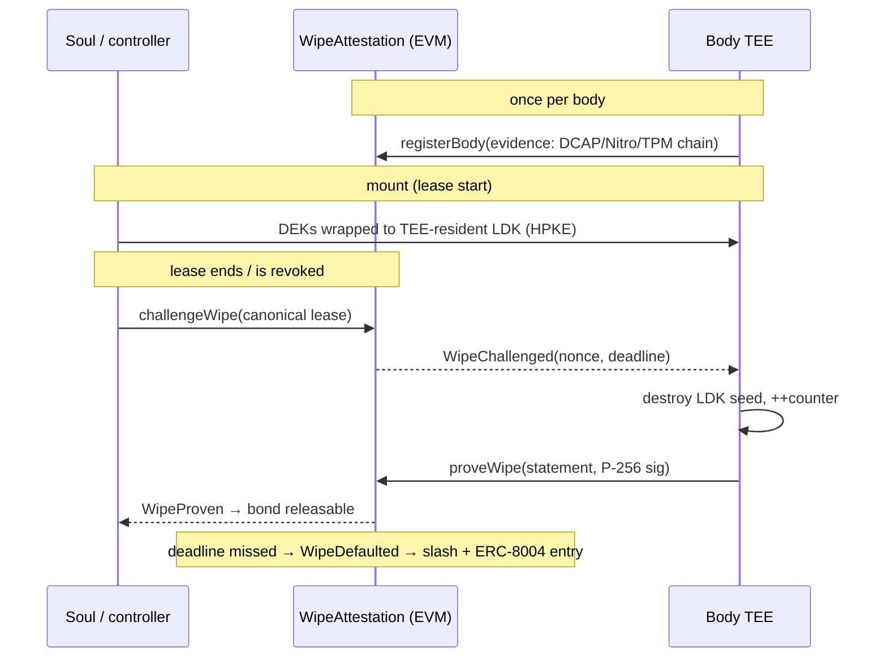
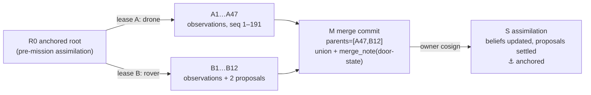

# Embodied AI Infrastructure — Architecture Brief

**Sprint deliverable: proposed solutions for the four known protocol gaps, plus newly identified architectural gaps.**

| | |
|---|---|
| Date | 2026-08-08 |
| Scope | ERC-8264 · ERC-8269 · CAAP-Capsule v0.1 · CAAP-ROBOTID v1.1 · WebMCP |
| Status | Research brief — proposals are draft-quality, ready for spec extraction |
| License | CC0, consistent with the rest of the stack |

---

## 0. Executive summary

The stack under review is coherent and its layering is right: **rights surface (ERC-8264) → lease/broker surface (ERC-8269) → chain-agnostic payload (CAAP-Capsule) → identity/finance (CAAP-ROBOTID)**. The four known gaps all resolve with existing, shipping primitives — no new cryptography is required:

1. **Hardware Proof of Deletion** → *attested crypto-erasure*: never prove "the data is gone" (unfalsifiable); prove instead that plaintext only ever existed inside a TEE boundary and that the TEE-resident key was destroyed. Heavy attestation verification happens **once at body enrollment**; every subsequent wipe proof is a single P-256 signature check against the enrolled key — ~7k gas on mainnet since Fusaka's EIP-7951 precompile. (§2.1, `CAAP-WIPE`)
2. **Swarm Memory Merge** → turn the Capsule into a **Merkle-DAG of capsule states** (git-style `parents`), with actor-namespaced record IDs so concurrent bodies *cannot* collide at the ledger layer, CRDT dominance rules for tombstones, and semantic conflicts deferred to owner-cosigned assimilation. ERC-8269's existing `proposal` scope and `requires_owner_cosign: ["canonical_write"]` already enforce the correct topology — the merge protocol formalizes what the lease vocabulary implies. (§2.2, `CAAP-MERGE`)
3. **Spatial & Telemetry Anchoring** → an MCAP-based record profile with **time-windowed chunk Merkle trees**: one `content_root` per record lets an arbitrator verify *one second of LIDAR* against a Bitcoin or EVM anchor with an O(log n) proof, without decrypting anything else. (§2.3, `CAAP-TELEMETRY`)
4. **Physical Liability** → a `LeaseBond` escrow contract reusing ERC-8183's role/state shape, funded through ERC-4337/EIP-7702 scoped allowances, arbitrated optimistically against CAAP-TELEMETRY disclosure proofs, and — critically — **bond release is gated on the Gap-1 wipe proof**, making the deletion attestation economically enforced rather than merely auditable. (§2.4)

The most important new findings (§3): the stack currently has **no story for the 4-orders-of-magnitude latency mismatch between chain finality and control loops** (fix: leases must *renew* like a dead-man's switch, not *revoke*); **sensor-channel prompt injection is a memory-poisoning attack that propagates across the fleet through the merge protocol** (fix: a unified taint model — a QR code on a wall and a malicious WebMCP tool description are the same attack class); **leases scope memory operations but not actuation** (nothing in the lease says how fast the robot may move); and **Capsules are a harvest-now-decrypt-later target** with a secp256k1-rooted identity that has no post-quantum succession path.

---

## 1. Current state of the stack — review notes

### 1.1 Layer map

| Layer | Artifact | Status | Role |
|---|---|---|---|
| Rights | **ERC-8264** (this repo, `ERCS/erc-8264.md`) | Draft, PR open | Four-op subject rights: `readMemory` / `writeMemory` / `deleteMemory` / `exportMemory`; ERC-165 id `0x13a642d4`; deployed on 3 testnets |
| Lease + Broker | **ERC-8269** (branch `add-erc-portable-agent-memory-capsule`) | Draft, PR open | Off-chain owner-signed Body Lease (EIP-191 over RFC-8785-style canonical JSON); Credential Broker rule (entitlement descriptors, never bearer material) |
| Payload | **CAAP-Capsule v0.1** (`rmem-gateway/standards/`) | Draft v0.1 | Manifest + SHA-256 binary Merkle commitment over ciphertext hashes; signature-suite registry (`eip-191`, `eip-191-authmsg`, `bip-322-legacy`); anchor registry (`caap-btc-opreturn-v1`, 38-byte OP_RETURN) |
| Identity/Finance | **CAAP-ROBOTID v1.1** (`rmem-gateway/`) | Spec complete | Soul ID (`did:btc:` secp256k1, EVM address derived from same key), Body ID (label + lease), Wallet ID (Lightning/NWC, daily caps), L402 purchase tiers P0–P3 |
| Neighbors | ERC-8004 (identity/reputation/validation registries), ERC-8183 (job escrow w/ evaluator), EIP-7702 (final, Pectra), EIP-7951 (P-256 precompile, live since Fusaka), ERC-4337/7579 (account abstraction / modular accounts) | — | Composition targets |
| Web | **WebMCP** (`navigator.modelContext`) | W3C WebML CG Draft Report (2026-02-12); Chrome 146 Canary preview | Pages declare callable tools to browser-resident agents; client-side, runs in the user's authenticated session |

### 1.2 Findings from close reading (pre-existing issues worth fixing regardless of the new work)

These surfaced while reviewing the specs and should be folded into the next revisions:

1. **Lease revocation is ambiguous under the current mechanism.** ERC-8269 revokes by "issuing a new manifest with the same `lease_id` and an `expires_at` in the past." That leaves *two validly signed lease objects with the same `lease_id`* in the world, and a verifier holding only the older one has no way to know it was superseded. Add a monotonic `revision` integer to the lease schema and specify **highest-revision-wins**; a gateway MUST reject a lease if it has ever seen a higher revision for the same `lease_id`. (This also gives the revocation log in "Body-lease revocation lag" a total order to replicate.)
2. **The lease has no domain separation.** An EIP-191 signature over canonical JSON with no `chain_id`, no gateway identifier, and no deployment binding can be replayed against any gateway that recognizes the subject. A lease minted for a sandbox gateway is honored by the production gateway. Either move to EIP-712 typed data with a domain separator, or add mandatory `audience` (gateway identifier / URL / contract address) and `chain_id` fields to the canonical lease JSON. Cheap fix, real attack.
3. **`eip-191-authmsg` binding gap** is already documented in CAAP §6.2 (the signature doesn't commit to `merkle_root`). Close it rather than document it: require `merkle_root` in the auth message for any capsule that will be *anchored* or used in liability contexts (§2.4 depends on content-binding).
4. **`exportMemory` as a single unpaginated view call** (flagged in ERC-8264's own security section) becomes acutely untenable once telemetry-scale records exist (§2.3). Recommend standardizing the paginated overload `exportMemory(subject, offset, limit)` in the next ERC-8264 revision rather than leaving it as an implementor SHOULD.
5. **CAAP-ROBOTID v1.1 explicitly defers manufacturer/TPM attestation** ("v1.1 does not standardize the attestation format"). §2.1 below is that missing module — designed so the same enrollment evidence serves body identity, wipe proofs, and liability apportionment.
6. **WebMCP composition note:** tool names/descriptions declared by a page via `navigator.modelContext` are attacker-controlled content entering the agent's instruction context. This is the same trust class as a QR code in a warehouse. §3, Gap B treats them under one taint model. Also note WebMCP runs inside the user's authenticated browser session — the session cookie *is* bearer material living in body memory, which collides with the Credential Broker rule (§3, Gap K).

---

## 2. Part 2 — Engineered solutions for the four known gaps

### 2.1 Gap 1 — Hardware Proof of Deletion (`CAAP-WIPE` v0.1)

#### 2.1.1 What is actually provable

"Prove the robot deleted the data" is, taken literally, unfalsifiable: no protocol can demonstrate the *absence* of copies on hardware the verifier doesn't control. Fifteen years of provable-deletion literature (Perito & Tsudik's *Proofs of Secure Erasure*, ESORICS 2010, onward) converges on the same reduction, which NIST SP 800-88 Rev. 1 codifies as **cryptographic erase (Purge class)**:

> Ensure plaintext is *only ever* recoverable through a key confined to a verifiable boundary; then prove destruction of that key.

So the standard must govern the **mount path**, not just the wipe: the deletion guarantee is manufactured at mount time or never.

**The sealed-mount invariant.** When a Capsule is mounted into a leased body (the `rmem-migrate.py` freeze → verify → *mount-with-re-encryption* flow already does re-encryption — this formalizes where the key lives):

1. Inside the body's TEE (TPM 2.0-backed enclave, SGX/TDX, AWS Nitro, or a secure element on embedded platforms), generate a fresh **Lease Data Key (LDK)** — unique per `lease_id`, sealed to the TEE's measured state, marked non-exportable.
2. The Soul's controller wraps the Capsule's record DEKs to the LDK via HPKE (RFC 9180). Plaintext exists only inside the boundary; general-purpose storage on the body only ever holds ciphertext.
3. The TEE maintains a **rollback-protected monotonic counter** (TPM NV counter, RPMB-backed slot, or equivalent — do not rely on SGX platform-service counters, which are deprecated on client SKUs).

**Wipe** = destroy the LDK seed + increment the counter + emit a signed statement. Every ciphertext copy anywhere — body disk, backups, intercepted transfers — becomes permanently undecryptable in one operation. This is also the strongest available reading of GDPR Art. 17 erasure for replicated stores (ERC-8264's own "Deletion finality" section already points this direction: hashes on-chain, purge off-chain).

#### 2.1.2 Enroll once (expensive), attest many (cheap)

Verifying a full attestation chain on-chain is expensive (a raw Intel DCAP quote verification in Solidity — e.g. Automata's on-chain DCAP verifier — costs millions of gas, or requires a ZK-compression step via RISC Zero/SP1). Doing that per wipe is absurd. The design splits the cost:

- **`registerBody` (once per physical body):** submit full evidence — TPM EK/AK certificate chain, or DCAP quote, or Nitro attestation document — to a pluggable `IEvidenceVerifier`. On success the registry caches `(bodyId → attestation pubkey BAK, measurement hash, verifier id)`. This is the missing "manufacturer attestation" module ROBOTID v1.1 deferred, and the enrollment record doubles as the body-identity anchor for liability apportionment (§3, Gap D).
- **`proveWipe` (per lease end):** one ECDSA-P256 verification of the TEE-signed `WipeStatement` against the cached BAK. With EIP-7951 (precompile at `0x100`, ~6,900 gas, mainnet since Fusaka; RIP-7212 on most L2s), the whole transaction lands well under ~60k gas. Wipe proofs are cheaper than an ERC-20 transfer.

#### 2.1.3 Interface

```solidity
// SPDX-License-Identifier: CC0-1.0
pragma solidity ^0.8.24;

/// @title CAAP-WIPE — attested crypto-erasure for ERC-8269 body leases
interface IWipeAttestation {

    enum WipeMethod { KeyDestruction, MediaPurge }   // 0 = crypto-erase (default)

    struct WipeStatement {
        bytes32 leaseId;      // keccak256 of canonical lease JSON (revision-latest)
        bytes32 bodyId;       // enrolled body
        bytes32 capsuleRoot;  // CAAP merkle_root whose LDK was destroyed
        bytes32 challenge;    // freshness nonce from challengeWipe
        uint64  counter;      // TEE rollback-protected counter, post-destruction
        uint8   method;       // WipeMethod
    }

    event BodyRegistered (bytes32 indexed bodyId, bytes32 measurement, uint8 keyType);
    event WipeChallenged (bytes32 indexed leaseId, bytes32 challenge, uint64 deadline);
    event WipeProven     (bytes32 indexed leaseId, bytes32 indexed bodyId,
                          bytes32 capsuleRoot, uint64 counter);
    event WipeDefaulted  (bytes32 indexed leaseId, bytes32 indexed bodyId);

    /// One-time enrollment. `evidence` is verified by the verifier module
    /// registered for `verifierId` (DCAP, Nitro doc, TPM EK/AK chain, ...).
    function registerBody(bytes32 bodyId, uint8 verifierId, bytes calldata evidence) external;

    /// Permissionless once the lease is provably ended: caller supplies the
    /// canonical lease JSON; the contract verifies the EIP-191 owner signature
    /// and that expires_at < block.timestamp (or that a higher-revision
    /// revocation exists). Emits a fresh challenge and starts the clock.
    function challengeWipe(bytes calldata canonicalLease) external returns (bytes32 challenge);

    /// TEE-signed statement; sig verified against the enrolled BAK via the
    /// P-256 precompile (EIP-7951 / RIP-7212). Statement hash MUST have been
    /// embedded in the TEE signing context (TPM2_Quote qualifyingData /
    /// SGX report_data / Nitro user_data).
    function proveWipe(WipeStatement calldata s, bytes calldata sig) external;

    /// Anyone may finalize a missed deadline; hooks fire (bond slash, ERC-8004
    /// validation entry, broker hard-revocation).
    function defaultWipe(bytes32 leaseId) external;
}
```

Notes on the mechanics:

- **Freshness:** the challenge nonce defeats replay of an old "clean" statement; the monotonic counter defeats rollback of TEE state to a pre-wipe snapshot. Both are required.
- **Off-chain lease, on-chain teeth.** `challengeWipe` demonstrates a nice property of ERC-8269's design: because the lease is canonical JSON with an EIP-191 signature, *any* lease can be verified on-chain from its bytes when a dispute needs it — the lease stays off-chain for the happy path and becomes on-chain evidence on demand. (Deployments using the on-chain `grantLease` path in `RmemMemoryRegistry` can check expiry directly instead.)
- **Composition:** `WipeProven` is the release condition for the §2.4 bond; `WipeDefaulted` slashes it and SHOULD post to the ERC-8004 Validation Registry so reputation systems see hygiene failures. The Credential Broker's revocation duty is unchanged — credentials die at lease end *regardless* of wipe status (belt), the wipe proof covers the capsule (suspenders).



#### 2.1.4 Honest limits (to be stated in the spec's security section)

- The proof covers the **sealed path only**. If plaintext ever left the TEE before sealing (mis-implemented mount, debug logging), no attestation recovers that. The spec must make sealed-mount a MUST with attested mount receipts (the TEE can sign a mount statement binding `lease_id → capsuleRoot → LDK` at mount time, giving the Soul evidence the invariant held from byte zero).
- TEE compromise (side channels, physical decap, firmware CVEs) converts the cryptographic guarantee into an economic one — which is precisely why §2.4 gates money on it. Verifier modules MUST track vendor TCB recovery / certificate revocation and reject enrollments on stale collateral.
- The robot's *own new observations* of previously decrypted content (it read a document aloud; the text is now in a new telemetry record) are out of scope — that's a data-governance question for the merge layer's taint model (§3, Gap B), not a key-destruction question.

---

### 2.2 Gap 2 — Swarm Memory Merge Protocol (`CAAP-MERGE` v0.1)

#### 2.2.1 Design stance

Git's model (content-addressed commits, explicit parents, branches, merge commits) is the right skeleton, but git's *conflict handling* — halt and ask a human to edit text — is wrong for a fleet. The correct split is:

- **Mechanical layer (the ledger): a CRDT.** Concurrent capsule states must merge deterministically, in any order, with no coordination — bodies are offline, in caves, under water.
- **Semantic layer (the mind): explicitly *not* auto-merged.** Whether the door is open, given the drone saw it open at 14:02 and the rover saw it shut at 14:31, is a *cognition* problem. The protocol's job is to guarantee both observations survive with provenance, and to force reconciliation through the owner-cosigned path the lease vocabulary already defines.

The stack anticipated this: ERC-8269's recommended lease grants bodies `write: ["L1_session", "proposal"]` and reserves `canonical_write` for `requires_owner_cosign`. **Bodies record observations and file proposals; only the Soul commits beliefs.** CAAP-MERGE formalizes exactly that topology.

#### 2.2.2 Wire changes (backward-compatible `x_` extensions to CAAP-Capsule v0.1)

Manifest gains a DAG header:

```json
"x_dag": {
  "parents":    ["sha256:<root-A>", "sha256:<root-B>"],
  "actor":      "lease_01J9…",
  "branch_seq": 47,
  "vclock":     { "lease_01J9…": 47, "lease_01JA…": 12 },
  "hlc":        "2026-08-08T17:03:22.123Z:0007:lease_01J9…"
}
```

- `parents` — Merkle roots of predecessor capsule states. One parent = ordinary checkpoint; N parents = merge commit. Genesis for each body branch is the capsule exported at lease grant (the fork point).
- `actor` — the `lease_id` under which this state was produced. The Soul's own assimilation commits use a distinguished actor (`soul`).
- `vclock` — version vector keyed by actor, for causal comparison (concurrent vs. ancestor) without walking the DAG.
- `hlc` — Hybrid Logical Clock (Kulkarni et al. 2014): physical-time-adjacent but causally monotonic; this is the timestamp the liability layer (§2.4) trusts for ordering, because pure wall clocks on robots are settable and pure Lamport clocks aren't evidentiary.

Records gain two fields:

```json
{ "record_id": "…", "payload_hash": "sha256:…",
  "class": "observation | proposal | belief | tombstone | merge_note",
  "provenance": { "actor": "lease_01J9…", "seq": 191, "taint": "sensor|web|human|derived" } }
```

**Record-ID rule (collision freedom by construction):** `record_id = keccak256(actor ‖ seq ‖ payload_hash)`. Two bodies can never write the same record ID, so the union of any two branches is always well-defined — data collision is eliminated at the namespace level, not resolved after the fact.

#### 2.2.3 The merge algorithm (deterministic; any replica computes the same result)

Given parent states `P₁…Pₙ`:

1. **Union** all record sets (dedupe by `record_id` — identical IDs are identical records).
2. **Apply tombstones** with two dominance rules:
   - *Owner-signed tombstones are remove-wins* — they beat any concurrent add, including re-adds. This makes GDPR/subject deletion (`deleteMemory`) final across the fleet: a delete propagates through every future merge and cannot be resurrected by a laggard body. (A tombstone carries the deleted `record_id`, not content.)
   - *Body-issued tombstones are add-wins* (OR-set semantics) — a body pruning its own L1 working memory never destroys another body's concurrent observation.
3. **L3 beliefs:** single-writer by construction (only owner-cosigned commits may carry `class: belief`), so "conflict" cannot occur — concurrent *proposals* targeting the same belief key both survive as proposals.
4. **Semantic conflict detection:** if two surviving records from concurrent branches (vclock-incomparable) target the same belief key or contradict a declared invariant, the merge MUST emit a `merge_note` record enumerating the conflict set — the machine equivalent of git's conflict markers, except execution does not halt: the merged capsule is valid and complete, with the disagreement *reified as memory*. Assimilation (below) is where it gets resolved.

Steps 1–3 form a join-semilattice (union + deterministic dominance), so merges are commutative, associative, and idempotent — the fleet converges regardless of merge order or topology. This is the Merkle-CRDT construction (Protocol Labs, 2020) specialized to CAAP's existing Merkle commitment.

**Assimilation** is the owner-cosigned merge commit in which the Soul reviews `merge_note`s and outstanding `proposal`s, promotes some to `belief`s, and tombstones the rest. Cognitively: the fleet's parallel experiences are append-only percepts; belief revision is a supervised, signed act. This is also the security chokepoint where the taint model (§3, Gap B) applies.

#### 2.2.4 Anchoring and equivocation

- Branch heads MAY anchor; **assimilation commits SHOULD anchor** (BTC OP_RETURN per `caap-btc-opreturn-v1`, or the to-be-registered `eth-event-log-v1` — recommend defining it as an indexed event `CapsuleAnchored(bytes32 indexed subjectHash, bytes32 indexed merkleRoot, bytes32 parentRoot)` so the DAG spine is walkable from logs alone).
- Two anchored heads with a common parent and **different** actors = normal concurrency. Two anchored heads with the **same** actor and incomparable `branch_seq` = **equivocation** — cryptographic evidence of a cloned/compromised body key. This is a slashable fault class in §2.4 and an automatic lease-revocation trigger.

#### 2.2.5 Worked example (drone + rover)



Drone (lease A) and rover (lease B) fork from anchored root R0. The drone crashes at minute 38 — its last exported head A47 and its telemetry chunks (§2.3) survive it, which is exactly what the liability process needs. The rover returns; the gateway computes merge M: union is trivial (disjoint actor namespaces), one `merge_note` records that A's `observation` "door D3 open @ HLC 14:02" and B's "door D3 shut @ HLC 14:31" both bear on belief `map.D3.state`. Assimilation S resolves the belief (*shut, last credible observation wins*), keeps both observations forever, and anchors. Nothing was lost, nothing collided, and the disagreement left an auditable trace.

---

### 2.3 Gap 3 — Spatial & Telemetry Anchoring (`CAAP-TELEMETRY` v0.1)

#### 2.3.1 Problem restatement

CAAP-Capsule commits to `payload_hash` over whole encrypted record files. For text/JSON memories that's fine. For a 40-minute mission producing tens of GB of LIDAR, IMU, and video, monolithic hashing destroys the two properties embodied deployments need: **selective disclosure** (prove second 1,207 of the mission to an arbitrator without shipping — or revealing — the other 39 minutes) and **tiered retention** (age raw data out without breaking the commitment chain). The fix is a record *profile*, not a new container.

#### 2.3.2 Container and codecs

- **Container: MCAP** (the CNCF-hosted, self-describing, chunk-indexed robotics log container; default rosbag2 storage since ROS 2 Iron). One MCAP file per telemetry record. MCAP gives schema-embedded, time-indexed, seekable chunks for free, and the entire ROS ecosystem already emits it — adoption cost approaches zero.
- **Inner codec registry** (extensible, like CAAP's suite registry): `draco` (point clouds/meshes), `laz` (survey-grade LIDAR), `octomap` (occupancy octrees), `posegraph-cbor` (SLAM keyframes + factor graph), `av1` (video), raw ROS 2 CDR for kinematics/IMU. Registry entries name the codec and its schema hash — a verifier can refuse un-registered codecs the way CAAP refuses unknown signature suites.
- **Canonicalization rule: none.** Floating-point re-serialization is a swamp; the standard hashes **encoded bytes exactly as captured**. Byte identity or nothing.

#### 2.3.3 The chunk Merkle tree — the load-bearing structure

Each telemetry record is chunked on capture (default: 1-second HLC windows, aligned to MCAP chunk boundaries). Per record:

```json
"x_content": {
  "content_root": "sha256:<merkle root over plaintext chunk hashes>",
  "chunking":     { "scheme": "hlc-window", "window_ms": 1000, "leaves": 2400 },
  "hlc_range":    ["…17:00:00.000…", "…17:40:00.000…"],
  "frame_graph":  "sha256:<tf/coordinate-frame snapshot hash>",
  "geo_cells":    ["s2:89c25c1d", "s2:89c25c1f"],
  "schemas":      ["ros2:sensor_msgs/msg/PointCloud2@<hash>"],
  "capture_sig":  "0x… body key over (content_root ‖ hlc_range ‖ counter)"
}
```

Two commitments per record, doing different jobs:

- `payload_hash` (CAAP §4.6, unchanged) — hash of the **ciphertext** file: transport/storage integrity.
- `content_root` — Merkle root over **plaintext chunk** hashes: selective disclosure. Revealing chunk *c* to an arbitrator takes the chunk bytes + O(log n) sibling path to `content_root` + the record's inclusion path to the capsule `merkle_root` + the anchor. **End-to-end: one second of sensor data provably committed, via a Bitcoin OP_RETURN or EVM event, at the time of anchoring — with zero disclosure of any other chunk.** This chain is what §2.4's arbitration consumes.

Supporting structure:

- **Spatial joinability:** `frame_graph` pins the coordinate-frame tree (ROS tf snapshot) so two bodies' chunks can be registered into a common frame at merge time; `geo_cells` (S2 or H3 cell IDs, coarse by design) make capsules spatially queryable — "all chunks near dock 4" — without decrypting payloads. Cell resolution is a privacy dial (§3, Gap I).
- **Capture signing:** each record's `content_root` is signed by the **body key** with the TEE counter — chaining sensor data → body → lease → Soul. A timestamp is evidence only if the key that vouches for it is enrolled (§2.1) and the clock is defensible (§3, Gap H).
- **Tiered retention:** T0 = raw chunks; T1 = distilled (keyframes, landmarks, occupancy diffs — the semantic residue the agent actually re-uses); T2 = hashes only. Aging T0→T2 never breaks the commitment chain — you can always prove *what was committed*, you just lose the ability to *reveal*. To stop "conveniently aged" evidence, §2.4 imposes a minimum T0 retention window ≥ the claim window, with adverse inference on failure to reveal.

---

### 2.4 Gap 4 — Physical Liability & Delegated Collateral (`LeaseBond` v0.1)

#### 2.4.1 Shape

Reuse ERC-8183's proven state machine (escrow + single evaluator + expiry refund) with the roles remapped from *commerce* to *custody*, and the evidence layer supplied by §2.3:

| ERC-8183 role | LeaseBond role |
|---|---|
| Client (funds escrow) | **Subject/Soul** — posts collateral at lease grant, via its smart account |
| Provider (paid on completion) | **Body lessor** — hardware owner; beneficiary of damage awards |
| Evaluator (sole attester) | **Arbiter** — a contract: optimistic oracle for the fast path, arbitration panel / ERC-8004 validation (TEE oracle, staked re-execution) for disputes |

The bond is keyed to `leaseHash = keccak256(canonical lease JSON)` — the same trick as §2.1: the off-chain lease binds on-chain money through its canonical hash, and the lease JSON reciprocally carries `x_bond: {chain_id, contract, bond_id}` so **a body can verify collateral exists before granting actuation**. No bond, no motors.

```solidity
interface ILeaseBond {
    enum Fault { PhysicalDamage, WipeDefault, CredentialRetention,
                 TelemetryWithheld, Equivocation }

    function post(bytes32 leaseHash, address token, uint256 amount,
                  address arbiter, uint64 claimWindow) external returns (uint256 bondId);

    /// Claimant (lessor, or third party via lessor) opens a claim against an
    /// incident window. `evidenceRoot` commits the claim's evidence bundle.
    function claim(uint256 bondId, Fault fault, uint256 amount,
                   uint64 hlc0, uint64 hlc1, bytes32 evidenceRoot)
        external payable returns (uint256 claimId);   // payable: claimant deposit

    /// Subject answers with a disclosure commitment: chunk Merkle proofs
    /// (§2.3) covering [hlc0, hlc1] against an anchored capsule root.
    function respond(uint256 claimId, bytes32 disclosureRoot) external;

    function settle(uint256 claimId, uint256 award, bytes32 reason) external; // arbiter only
    function release(uint256 bondId) external; // expiry + claimWindow elapsed
                                               // + no open claims + WipeProven
}
```

#### 2.4.2 Claim lifecycle

1. **Incident.** Rover damages a loading door at ~14:31. Lessor calls `claim(PhysicalDamage, amount, hlc0, hlc1, evidenceRoot)` posting a claimant deposit (griefing guard — forfeited on frivolous claims).
2. **Disclosure.** The subject `respond`s with Merkle-proven telemetry for the window: kinematics, commanded torques, perception snapshots — verified against a capsule root **anchored before the claim existed**, so evidence can't be retro-fabricated by either side. In the multi-body case, actor-tagged records + HLC ordering (§2.2) establish *which lease* had control of *which body* at the incident instant — this is precisely the "arbitrage by telemetry timestamps" requirement.
3. **Fast path (optimistic).** Undisputed after the liveness window → auto-settle, UMA-style. Most claims between repeat counterparties should end here.
4. **Dispute path.** Arbiter contract resolves — Kleros-style panel, or an ERC-8004 Validation Registry hook (TEE oracle re-running the perception stack against disclosed chunks; staked re-execution). Award pays from bond; remainder returns at `release`.
5. **Adverse inference.** No `respond` within the deadline, or disclosure that fails Merkle verification → `TelemetryWithheld`; the arbiter MAY award up to the cap. Silence is not a strategy.

One bond, five enumerated fault classes — `WipeDefault` (§2.1) and `Equivocation` (§2.2.4) slash the *same* collateral as physical damage. **This is the keystone coupling: the deletion attestation and the anti-cloning property are enforced by the money, not by goodwill.** `release` requiring `WipeProven` means a lessor is never left holding an un-wiped capsule *and* no recourse.

#### 2.4.3 Funding-side composition (delegated collateral)

- The Soul's smart account (ERC-4337, or an EIP-7702-delegated EOA — the Soul's `evm_address` derives from the same secp256k1 key, so 7702 fits natively) grants a **session-scoped allowance**: a spending-limit policy (ERC-7579 executor module or equivalent) authorizing `LeaseBond.post` up to a cap, per lease, per epoch. The agent can lease bodies autonomously without ever holding an unscoped key — the exact analogue of the Credential Broker rule, applied to money.
- **L402 tier mapping (ROBOTID §5):** micro-bonds under the daily cap = **P1** (wallet-gated); standard body lease bonds = **P2** (soul-signed); bonds above a configured threshold, or claims settlement beyond the bond = **P3** (human cosign). The tiers were designed for purchases; they map onto collateral without modification.
- **Underwriting hook (optional):** a staking pool may post the bond on the subject's behalf for a premium, priced off ERC-8004 reputation + the subject's `WipeProven`/claims history — an on-chain actuarial record that accumulates automatically from §2.1–§2.3 events. Slash waterfall: bond → pool → ERC-8004 reputation entry (the record of default follows the identity forever, which for a persistent Soul ID is the real deterrent).

---

## 3. Part 3 — New gaps, prioritized

Ordered by (severity × how much of the stack the fix touches). P0 = architectural, blocks safe deployment; P1 = required before production scale; P2 = required before adversarial/long-horizon maturity.

### P0

**Gap A — The latency inversion: chains cannot be in the control loop.**
Robot control runs at 100 Hz–1 kHz; L2 soft confirmation is ~200 ms–2 s; L1 finality is minutes; congestion is unbounded. Any design where *revocation* must reach the body to stop it fails open: a hijacked body simply stops listening. **Invert the default: leases must be *renewed*, not revoked.** The lease becomes a dead-man's switch — the gateway issues short-lived operating tickets (seconds–minutes, signed off-chain, verified locally on the body) against the lease; no fresh ticket → body enters safe state autonomously. On-chain revocation then only needs to reach the *gateway* (one well-connected party), not the robot. The chain is the **court and the ledger — never the controller**. This reframing should be stated normatively in ERC-8269 (it currently says revocation "MUST be effective immediately for subsequent operations," which no chain can deliver to an adversarial body; ticket non-renewal can). Composes with Gap E's safe-state machine.

**Gap B — Sensor-channel injection is a *fleet-wide memory-poisoning* attack.**
A QR code on a wall, an adversarial patch on a stop sign (Eykholt et al. 2018), an inaudible ultrasonic command (DolphinAttack, 2017), a laser into a MEMS microphone (Light Commands, 2019), LIDAR spoofing (Cao et al. 2019) — and equally a malicious WebMCP tool description — are one attack class: **untrusted content crossing into the instruction channel**. The embodied twist: a successful injection doesn't just misdirect one body — it *writes memory*, and §2.2 then faithfully replicates the poison into the merged capsule and every future body. The stack already has the right chokepoints; they need to be made normative: (1) every record carries `provenance.taint` (§2.2.2) — sensor- and web-derived content is **data, never instructions**, at every layer including assimilation prompts; (2) bodies write `observation`/`proposal` only — the injection cannot reach `belief` without the owner-cosigned assimilation review, which MUST treat tainted-provenance proposals as adversarial input; (3) contradiction between tainted proposals and anchored beliefs quarantines the proposing record, and repeated quarantines from one body trip ticket non-renewal (Gap A). Assimilation is the fleet's immune system — resource it accordingly.

**Gap C — Leases scope memory, not actuation.**
ERC-8269 `scopes` govern `read/write/delete/export` — nothing in the protocol stack says the leased rover may not exceed 1 m/s, leave a geofence, exert >40 N, or operate its cutting tool. Liability (§2.4) is undischargeable without this: the arbiter needs a *contract-referenced safety envelope* to judge telemetry against ("was the commanded torque within the leased envelope?"). Add an `actuate` scope family to the lease schema — `{max_velocity, geofence: [s2 cells], force_class, tool_classes, human_proximity_class}` — enforced at the body's local safety layer (below the cognitive stack, Gap E), signed into the lease, and priced into the bond. This turns the lease into the on-chain twin of a robot work-cell risk assessment, which is also the artifact regulators and insurers will actually ask for.

### P1

**Gap D — Nothing attests the *mind* in the body.**
§2.1 attests the enclave and the wipe — but not **which model** was driving. A lessor can swap a certified cognition stack for a cheaper or malicious one (or a stale, un-patched one) with no protocol-visible trace; liability apportionment between "the model misjudged" (subject's fault domain) and "the hardware failed" (lessor's) is impossible without knowing what ran. Extend body enrollment + lease with a **cognition manifest**: measured launch of the inference runtime (TEE measurement covering weights hash, safety-policy hash, perception-stack version), referenced as `x_cognition` in the lease, attested in the §2.1 mount receipt. ERC-8004's validation registry (TEE oracles) is the natural verification rail. Without this, §2.4 arbitration has a hole an adversarial lessor will drive through.

**Gap E — No safe-handback state machine (lease death ≠ power cut).**
The credential cliff at `expires_at` is dangerous in the physical world: a surgical arm, a highway vehicle, a drone at altitude cannot lose authority mid-motion. Conversely, safety interlocks must not be lease-gated: an e-stop that checks credential validity is a lawsuit. Define normative terminal states — `active → expiring(handback) → safe_stated → wiped` — where `expiring` guarantees a bounded, envelope-constrained trajectory to a safe state (per Gap C's envelope) *before* credentials drop, and hardware safety functions (ISO 10218 / ISO 13482 / IEC 61508 class) sit **below** the lease layer, unconditionally. The wipe challenge clock (§2.1) MUST start at `safe_stated`, not at `expires_at`.

**Gap F — Harvest-now-decrypt-later against eternal Capsules; no PQ succession for the Soul.**
Capsules are designed to outlive bodies by decades, are replicated by design, and their manifests are publicly anchored. Recorded ciphertext falls to a future CRQC if DEK wrapping is classical ECDH. The hash spine is fine (SHA-256 Merkle roots lose only Grover-halved margin) and the suite registry gives signature agility — but **encryption is the emergency**: mandate hybrid HPKE (X25519 + ML-KEM-768, the X-Wing construction; FIPS 203) for all DEK wrapping *now*, because today's exports are already being harvested. Register `ml-dsa-65` and `slh-dsa` signature suites (FIPS 204/205) in CAAP §6. The hard residue is identity: the Soul ID *is* a secp256k1 key, and "Soul ID compromise is unrecoverable" (ROBOTID). Add a **PQ succession commitment** to the Soul DID document — a hash pre-commitment to a post-quantum successor pubkey, generated air-gapped alongside the Soul key — so that when migration day comes, the successor key can prove continuity of lineage instead of severing it.

**Gap G — Cross-chain state fragmentation.**
ERC-8264 is already deployed at the same address on three chains; leases, wipe records, and bonds will fragment across them. A lease revoked on Base while the body's gateway watches Sepolia is a live exploit, and "same address" actively invites the confusion. Designate a **home chain per subject** in the Soul DID document; all lease/wipe/bond state for a subject lives there; other deployments are read-mirrors at best. (Subsumes the domain-separation fix from §1.2-2.)

### P2

**Gap H — Time is load-bearing and unattested.**
Lease expiry, HLC ordering, incident windows, ticket renewal — all hang on clocks that a body operator can set. Require an attested time base for capture signing: TEE clock where available, cross-checked against Roughtime/NTS (RFC 8915), with the time-source class recorded in `x_content`. An arbiter should be able to *see* that a timestamp is secure-element-backed vs. best-effort.

**Gap I — The swarm's metadata is a surveillance surface.**
Anchors are commitment-only (good), but enrollment, bond, wipe, and anchor *events* — plus `geo_cells` — let a chain analyst reconstruct fleet size, operational tempo, and movement patterns of a physical agent. Stalking a robot is stalking its principal. Mitigations to spec: nullifier-style unlinkable wipe/bond events (prove "some enrolled body of some bonded lease wiped" without linking which), coarse-only geo cells in manifests, and per-mission ephemeral actor IDs with an owner-held linking key.

**Gap J — Economic griefing on the enforcement rails.**
Permissionless `challengeWipe` invites deadline-spam against bodies in dead zones; claim deposits deter frivolous claims but gas-price spikes during a headline incident can price a subject out of `respond` within the deadline. Deadlines must be generous, gas-aware (EIP-1559-median-indexed), and pausable by the arbiter; challenges against a lease already in `expiring/safe_stated` (Gap E) must be free to answer late.

**Gap K — WebMCP sessions violate the Credential Broker rule.**
An embodied agent browsing through WebMCP operates inside an authenticated browser session — cookies and tokens are exactly the raw bearer material ERC-8269 §2 bans from portable memory, yet they live in body-resident browser state and are trivially exported by a compromised body. Spec the integration: per-lease ephemeral browser profiles minted by the broker and destroyed with the LDK (§2.1 — the wipe should cover browser state); WebMCP tool-call *receipts* (tool name, args hash, origin, result hash) written to the capsule as `observation` records with `taint: web`, giving the same provenance treatment as physical sensors (Gap B) and an audit trail of everything the agent did on the web under each lease.

---

## 4. Composition map

| New module | Consumes | Feeds |
|---|---|---|
| `CAAP-WIPE` (§2.1) | ERC-8269 lease (canonical hash, expiry); TEE/TPM evidence; EIP-7951 | `LeaseBond.release`; ERC-8004 validation entries; broker revocation hooks; ROBOTID's missing attestation module |
| `CAAP-MERGE` (§2.2) | CAAP-Capsule `x_` extensions; ERC-8269 scope vocabulary (`proposal`, cosign) | Assimilation audit chain; equivocation evidence → `LeaseBond`; taint chokepoint (Gap B) |
| `CAAP-TELEMETRY` (§2.3) | MCAP/codec ecosystem; body keys (§2.1 enrollment); HLC (§2.2) | Selective-disclosure proofs → `LeaseBond.respond`; spatial joins at merge |
| `LeaseBond` (§2.4) | ERC-8183 state machine; ERC-4337/7702/7579 allowances; L402 tiers; §2.1–2.3 evidence | ERC-8004 reputation; underwriting pools; lessor go/no-go (`x_bond` check) |

Recommended sequencing: **Gap A's ticket-renewal reframing and §1.2's lease-schema fixes first** (they change ERC-8269 normative text and everything downstream signs lease bytes); then CAAP-WIPE + LeaseBond as one unit (they are economically coupled); CAAP-TELEMETRY next (evidence layer must exist before claims can be adjudicated); CAAP-MERGE last (it extends a wire format that should stabilize after the telemetry profile lands).

---

## 5. Sources

**Stack under review:** [ERC-8264 (this repo)](https://github.com/clavote-boop/ERCs/blob/master/ERCS/erc-8264.md) · [ERC-8269 discussion](https://ethereum-magicians.org/t/erc-8269-body-lease-and-credential-broker/28597) · [rmem-gateway — CAAP-Capsule v0.1, CAAP-ROBOTID v1.1, reference implementation](https://github.com/clavote-boop/rmem-gateway)

**Ethereum primitives:** [EIP-7951: secp256r1 precompile](https://eips.ethereum.org/EIPS/eip-7951) · [Fusaka mainnet announcement](https://blog.ethereum.org/2025/11/06/fusaka-mainnet-announcement) · [Fusaka EIPs overview (Conduit)](https://www.conduit.xyz/blog/ethereum-fusaka-upgrade-eips-cheat-sheet/) · [ERC-8004: Trustless Agents](https://ethereum-magicians.org/t/erc-8004-trustless-agents/25098) · [ERC-8183: Agentic Commerce](https://eips.ethereum.org/EIPS/eip-8183) · [ERC-7579](https://github.com/ethereum/ERCs/blob/master/ERCS/erc-7579.md)

**WebMCP:** [WebMCP technical notes (W3C CG)](https://w3c-cg.github.io/aikr/webMCP/webmcp-technical-notes.html) · [State of WebMCP, July 2026 (Spronta)](https://www.spronta.com/blog/state-of-webmcp-july-2026/) · [WebMCP reality check (Studio Meyer)](https://studiomeyer.io/en/blog/webmcp-reality-check-may-2026) · [WebMCP cheat sheet (Webfuse)](https://www.webfuse.com/webmcp-cheat-sheet)

**Adjacent literature relied on in the designs** (from research memory; verify citations during spec extraction): NIST SP 800-88 Rev. 1 (cryptographic erase); Perito & Tsudik, *Proofs of Secure Erasure* (ESORICS 2010); RFC 9180 (HPKE); RFC 8785 (JCS); FIPS 203/204/205 (ML-KEM / ML-DSA / SLH-DSA); Kulkarni et al., *Hybrid Logical Clocks* (2014); Merkle-CRDTs (Protocol Labs, 2020); MCAP container / rosbag2; Draco, LAZ, OctoMap, S2/H3; UMA optimistic oracle & Kleros arbitration patterns; Automata on-chain DCAP attestation; Eykholt et al. 2018 (adversarial patches); Zhang et al. 2017 (DolphinAttack); Sugawara et al. 2019 (Light Commands); Cao et al. 2019 (LIDAR spoofing); ISO 10218 / ISO 13482 / IEC 61508; RFC 8915 (NTS) & Roughtime.

---

*Brief prepared on branch `claude/embodied-ai-infrastructure-vqm4c7`. All proposals CC0 to match the stack.*
